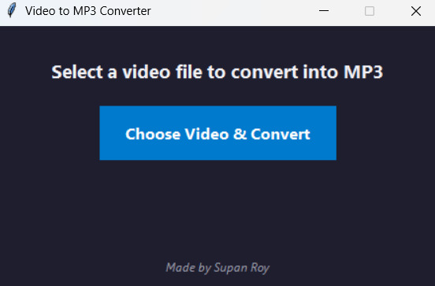

# Video to MP3 Converter

A simple Python application with a GUI that allows users to convert video files into MP3 audio files easily.

## Features

- Supports popular video formats like MP4, MKV, AVI, MOV, FLV.
- Easy-to-use graphical interface built with Tkinter.
- Dynamic file selection with a file dialog.
- Saves audio file in the same directory.

## Requirements

- Python 3.6+
- `moviepy` library
- `tkinter` (usually included with Python)

## Installation

1. Clone the repository or download the source code.

2. Create and activate a virtual environment (optional but recommended):

```bash
python -m venv .venv
source .venv/bin/activate  # Linux/Mac
.venv\Scripts\activate     # Windows
```
## 📸 GUI Preview

